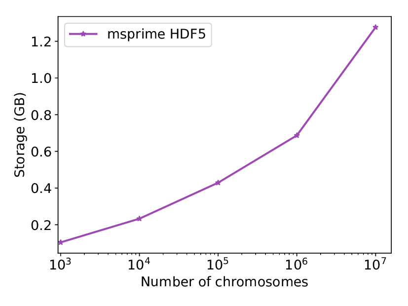
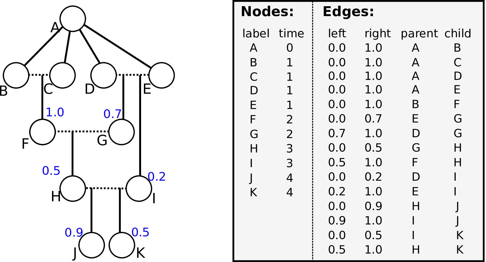
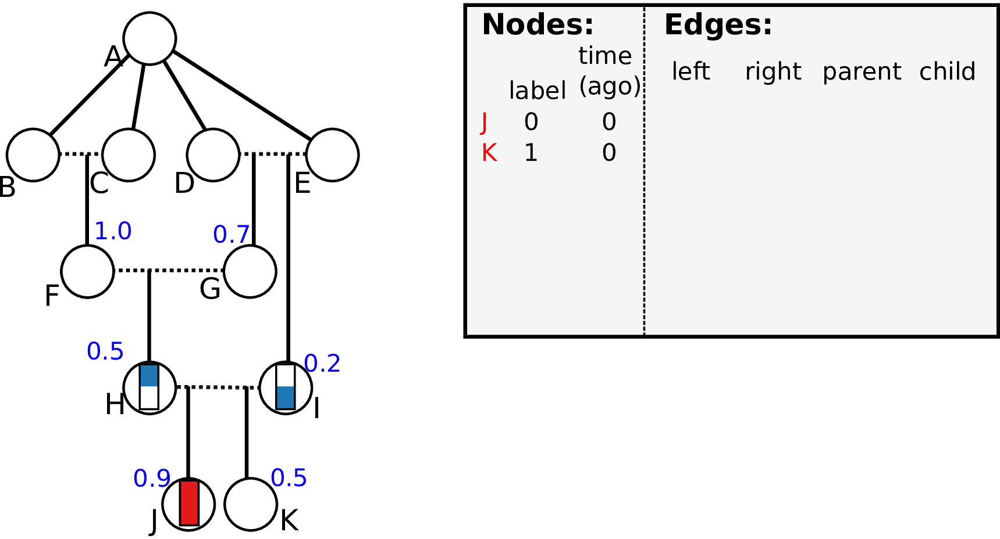
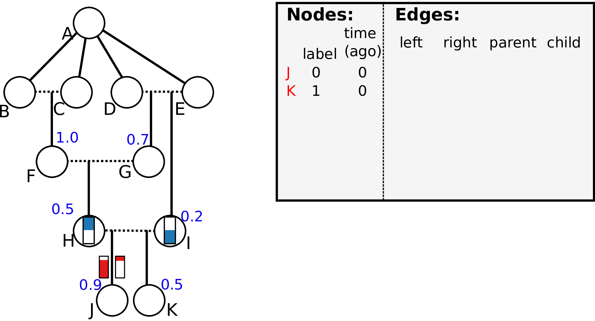
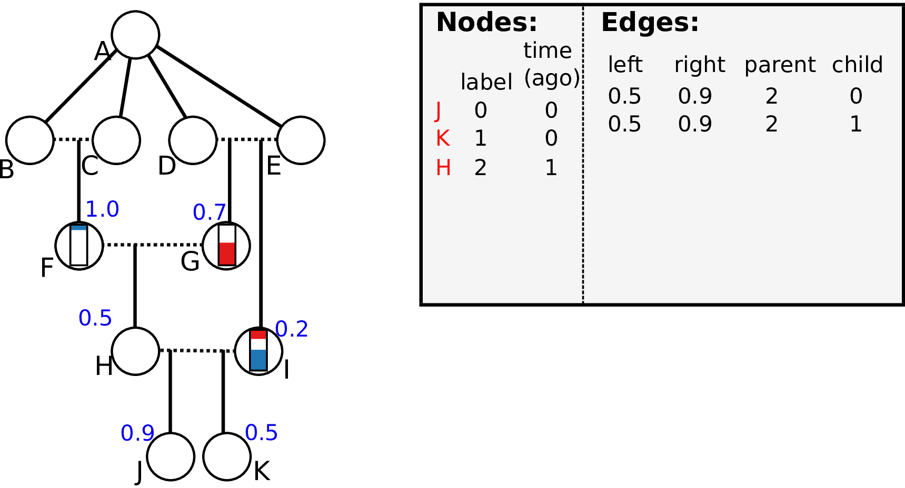
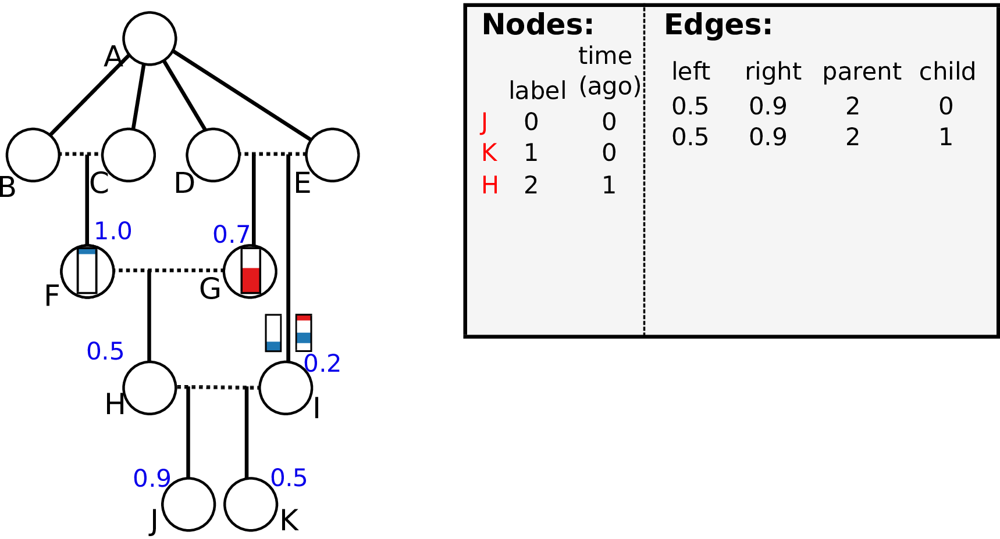
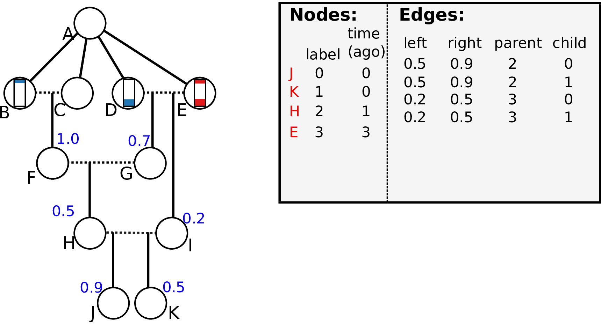
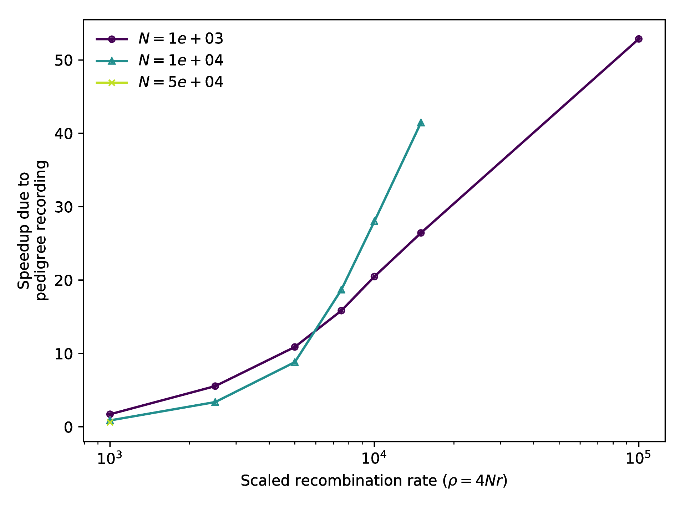

1. explain tree sequences and why they are so efficient (5min)
2. advertise tskit (1min)
3. recall uses for fwds sims (2min)
4. explain application to fwds sim recording (5min)
5. display impressive speedups 2min)
6. advertise other reasons to have output in tree sequences (2min)

<!-- 1. explain tree sequences and why they are so efficient (5min) -->
# The tree sequence

## History is just a sequence of trees

## ARG?

::: {.incremental}

1. The *pedigree* (parental relationships) and crossover locations
    would give us the tree sequence for *everyone, ever*.

2. Much less can fully describe the history relevant to a *sample* of genomes.

3. The information is equivalent to the Ancestral Recombination Graph (ARG).

4. ARGs are *hard*, to infer from data, or to work with analytically.

:::

-------------

[Kelleher, Etheridge, and McVean](http://journals.plos.org/ploscompbiol/article?id=10.1371/journal.pcbi.1004842) 
introduced the **tree sequence** data structure
to make a fast coalescent simulator.

- stores genealogical *and* variation data **very** compactly

- efficient algorithms available:

    * calculation of allele frequencies in arbitrary cohorts
    * linkage disequilibrium
    * subsetting
    * log-time haplotype matching

## Simulated file sizes

::: {.columns}
::::::: {.column width="50%"}

:::
::::::: {.column width="50%"}

- HapMap chr1 genetic map (250Mb)
- Gutenkunst et al out-of-Africa model (3 pops)
- mutation rate $2 \times 10^{-8}$ per gen
- $n=10^7$ 

    * about 17 million variants
    * VCF size: 318 TiB (250,000$\times$ larger)

:::
:::::::

## Example: three samples; two trees; two variant sites

## Nodes and edges

Edges 

:   Common ancestor (i.e., coalescent) events.

    Records: interval (left, right); parent node; child node.

Nodes 

:   The ancestors those happen in.

    Records: time (of birth); ID (implicit).

-------------------

-------------------

-------------------

-------------------

-------------------

-------------------

-------------------

## Sites and mutations

Mutations

:   When state changes along the tree.

    Records: site it occured at; resulting state; ID (implicit).

Sites 

:   Where mutations fall on the genome.

    Records: genomic position; ancestral (root) state.

------------------

------------------

------------------

------------------

------------------

## Succinct tables

A *tree sequence* is the data structure encoding
this sequence of trees (with mutations).

A tree sequence can be stored *succinctly* using
the four tables: *nodes*, *edges*, *sites*, and *mutations*.

. . .

These are stored efficiently (hdf5) on disk
with a column for metadata.

<!-- 2. advertise tskit (1min) -->
# tskit

## Tree sequence operations

We can do these things "very fast":

1. Read in: tables $\rightarrow$ tree sequence
2. Write out: tree sequence $\rightarrow$ tables
3. Iterate over trees,
4. while computing some statistic (AFS, $\pi$, $f_4$, LD, \ldots)
5. Simplify (i.e., subset).

. . .

*Upcoming:* tools for dealing with tree sequences
will be part of [*tskit*](https://github.com/tskit-dev/tskit).

## tsinfer

What about *real* data?

Also in progress: *tsinfer* (Kelleher, McVean)
to infer tree sequences from real data.

Video:
[Simulating, storing & processing genetic variation data w/millions of samples](https://www.youtube.com/watch?v=MH2b9iU4oUA)

<!-- 3. recall uses for fwds sims (2min) -->
# Forwards simulations are useful

## Why forwards simulations?

Coalescent simulations are *much faster*
than forwards-time simulations

. . .

because they don't have to keep track of *everyone*,
only the ancestors of your sample.

. . .

**But:** selection, or sufficient geographic structure,
break the assumptions that coalescent simulations rely on.

## Geography, and selection

So, if you

1. have more than a couple of loci under selection, and/or
2. have fine enough scale geography that demographic fluctuations are important
    (e.g., continuous space)

then you have to do forwards-time, individual-based simulations.

## Whole genomes?

To model linked selection,
we need chromosome-scale simulations.

. . .

Then every individual needs to carry around her genotype (somehow).
Even at neutral sites!

. . .

Bummer.

. . .

*Or not?*

<!-- 4. explain application to fwds sim recording (5min) -->
# Tree sequence recording

## The main idea

If we *record the tree sequence*
that relates everyone to everyone else,

after the simulation is over we can put neutral mutations down on the trees.

. . .

Since neutral mutations don't affect demography,

this is *equivalent* to having kept track of them throughout.

------------

This will have us recording the entire genetic history of everyone in the population,
ever,
as we go along.

.  . .

It is *not* clear this is a good idea.

## Tree recording strategy

To record a tree sequence in real time,
every time an individual is born, we must:

::: incremental

1. add each gamete to the Node Table,
2. add entries to the Edge Table
    recording which parent each gamete inherited each bit of genome from, and
3. add any new mutations to the Mutation Table 
    and (if necessary) their locations to the Site Table.

:::

. . .

::: {.columns}
:::::: {.column width=15%}

{width="100%"}

:::
:::::: {.column width=5%}

:::
:::::: {.column width=75%}

This is *not* a good idea.  
It produces **waaaaay** too much data.

:::
::::::

## Simplification

*Question:* given a tree sequence
containing the history of many individuals,
how do we *simplify* it to only the history
of a subset?

-----------

Concretely, given an input tree sequence
and a subset of its nodes we call the *samples*,
we want a new tree sequence for which:

1. All marginal trees match the corresponding subtree 
    in the input tree sequence.

2. Every non-sample vertex in marginal trees have at least two children.

3. All nodes and edges ancestral at least one sample.

4. No adjacent redundant edges 
    (e.g., $(\ell, x, p, c) + (x, r, p, c) \rightarrow (\ell, r, p, c)$).

-----------

*Answer:* to simplify a tree sequence
to the history of the *samples*:

1. Paint each *sampled* chromosome a distinct color.

2. Moving back up the tree sequence,
    copy colors of each chromosome to the parental chromosomes
    they inherited from.

3. If two colors go in the same spot (*coalescence*),
    replace with a new color (unique to that ancestor).
    Output a node for the ancestor and an edge for the coalescence.)

4. Once all colors have coalesced in a given segment,
    stop propagating it.

## An example: simplify these to J and K

{ width="100%" }

-------------------

{ width="100%" }

-------------------

{ width="100%" }

-------------------

{ width="100%" }

-------------------

{ width="100%" }

-------------------

{ width="100%" }

-------------------

{ width="100%" }

-------------------

{ width="100%" }

-------------------

{ width="100%" }

-------------------

{ width="100%" }

-------------------

{ width="100%" }

-------------------

{ width="100%" }

-------------------

{ width="100%" }

-------------------

{ width="100%" }

-------------------

{ width="100%" }

-------------------

{ width="100%" }

-------------------

{ width="100%" }

## Another example: before simplification

## Another example: before simplification

## ... and after simplification

## *Revised* tree recording strategy

To record a tree sequence in real time,
every time an individual is born, we must:

1. add each gamete to the Node Table,
2. add entries to the Edge Table
    recording which parent each gamete inherited each bit of genome from
3. add any new mutations to the Mutation Table 
    and (if necessary) their locations to the Site Table.

4. Every so often, *simplify* the tables stored in memory.

<!-- 5. display impressive speedups 2min) -->
# Implementation and results

## Benchmark implementation

- Recording, simplifying, and output of tables: 
    `C` code in `msprime`. (soon: `tskit`)

- Simulation: [`fwdpp`](https://github.com/molpopgen/fwdpp), by Kevin Thornton (in `C++`) ([code](https://github.com/molpopgen/fwdpy11_arg_example))

- Glue: [`pybind11`](https://github.com/pybind/pybind11/)

. . .

*Also:* a pure `python` implementation,
interfacing with [`simuPOP`](https://github.com/BoPeng/simuPOP).

## Simulation parameters

1. Wright-Fisher population of size $N$
2. simulated for $10N$ genreations
3. neutral mutation rate $\mu$ equal to recombination rate $r$ per gamete
4. many, weakly deleterious mutations: rate $\mu/100$ with
    $s$ exponentially distributed with mean $2.5/N$.

. . .

*Note:*
if we recorded tree sequences ("pedigree recording")
then the neutral mutation rate was *zero*
but neutral mutations were added *afterwards*.

------------------

To compare simulations,
the key parameter is the expected *total* number of crossovers per generation,
or:
$$\begin{aligned}
    \rho = 4 N r ,
\end{aligned}$$
since this gives the expected number of *distinct trees* in the tree sequence.

--------------------------

{ width=80% }

--------------------------

{ width=80% }

## Memory use

RAM use is kept down by simplifying as often as you need to.

<!-- 6. advertise other reasons to have output in tree sequences (2min) -->

# Moving forward

## Tree sequences ...

1. are compact, useful ways to store population history
    *including* genome sequence.

2. can be succinctly encoded in a set of tables,
    which we provide tools for using.

3. can be output during a forwards-time simulation,

4. which makes much larger simulations feasible.

## Future uses

1. Machine learning needs *good*, *fast* simulations to train on.

2. Tree sequences allow quick computation of many genomic statistics
    from real data.

. . .

*Current work:* tree sequence recording in [SLiM](https://messerlab.org/slim/)
(with Jared Galloway).

# Thanks

## Acknowledgements

Funding: NSF (PR); Wellcome Trust (JK); NIH (KRT); USF&WS (JDA).

Slides with [reveal.js](http://hakim.se) and [pandoc](https://pandoc.org/).

